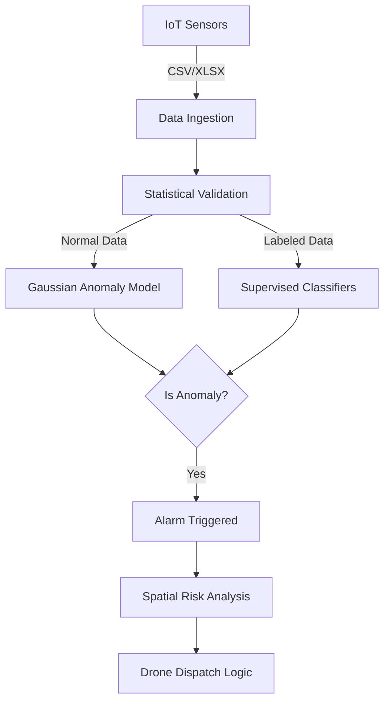

# System Architecture

## 1. High-Level Data Flow

## 2. Component Design

### A. Data Ingestion Layer

- **Input**: Raw sensor data (Temperature, Humidity, TVOC, eCO2, etc.).
- **Processing**: Deduplication, Missing Value Imputation.

### B. Statistical Analysis Engine

- **Normality Checks**: Shapiro-Wilk tests to determine feature distribution.
- **Correlation**: Heatmaps to identify redundant features (e.g., PM1.0 vs PM2.5).

### C. Modeling Core (Dual-Track)

1. **Unsupervised Track**:
    - Uses **Multivariate Gaussian Distribution**.
    - Learns $\mu$ and $\Sigma$ from normal data.
    - Flags samples with $P(x) < \epsilon$.
2. **Supervised Track**:
    - SMOTE for balancing.
    - **Ensemble Voting**: Combines RF, GBM, and SVM.

### D. Operational Output

- **Risk Heatmap**: Visualizes high-probability fire zones on a map.
- **Drone Command**: Auto-generates coordinates for drone stations using **K-Means Clustering**.
