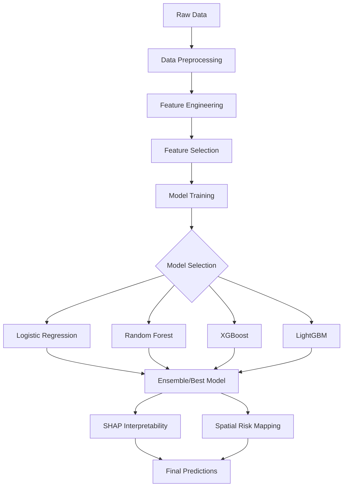

<


**An end-to-end machine learning pipeline for early detection of forest fires and smoke from aerial imagery data.**

[Getting Started](#-getting-started) • [Features](#-features) • [Architecture](#-architecture) • [Results](#-results) • [Documentation](#-documentation)

</div>

---

## 📋 Table of Contents

- [Overview](#-overview)
- [Features](#-features)
- [Project Structure](#-project-structure)
- [Getting Started](#-getting-started)
- [Dataset](#-dataset)
- [Methodology](#-methodology)
- [Model Architecture](#-model-architecture)
- [Results](#-results)
- [Visualizations](#-visualizations)
- [Contributing](#-contributing)
- [License](#-license)

---

## 🎯 Overview

Forest fires pose a significant threat to ecosystems, human lives, and property worldwide. Early detection is crucial for effective fire management and mitigation. This project implements a **comprehensive AI pipeline** that leverages machine learning techniques to detect forest fire and smoke signatures from aerial imagery data.

### Key Objectives

- 🔍 **Early Detection**: Identify fire and smoke signatures before they escalate
- 📊 **Risk Assessment**: Provide spatial risk scores for proactive fire management
- 🎨 **Interpretability**: Offer transparent model explanations using SHAP and LIME
- 🗺️ **Spatial Visualization**: Generate risk heatmaps for geographic analysis

---

## ✨ Features

| Feature | Description |
|---------|-------------|
| **Multi-Model Comparison** | Evaluate Logistic Regression, Random Forest, XGBoost, and LightGBM |
| **Advanced Feature Engineering** | Spectral ratios, texture aggregations, and domain-specific features |
| **Statistical Rigor** | Hypothesis testing, normality checks, and correlation analysis |
| **Feature Selection** | Variance threshold, SelectKBest, and RFE methods |
| **Hyperparameter Tuning** | Randomized search with cross-validation |
| **Model Interpretability** | SHAP values for global and local explanations |
| **Spatial Analysis** | Grid-based risk aggregation and heatmap visualization |
| **Reproducibility** | Seed fixing, model export, and configuration tracking |

---

## 📁 Project Structure

```
AI-Based-Forest-Fire-Smoke-Detection-Capstone/
│
├── 📓 Forest_Fire_Smoke_Detection.ipynb   # Main analysis notebook
├── 📊 Forest Fire Smoke Dataset.xlsx      # Dataset file
├── 📄 AI Based Forest Fire Smoke Detection Capstone.pdf  # Project documentation
├── 📝 notes.txt                           # Technical skills reference
│
├── 📋 README.md                           # This file
├── 🏗️ ARCHITECTURE.md                     # System architecture documentation
├── 🤝 CONTRIBUTING.md                     # Contribution guidelines
├── 📦 requirements.txt                    # Python dependencies
├── ⚖️ LICENSE                             # MIT License
└── 🚫 .gitignore                          # Git ignore rules
```

---

## 🚀 Getting Started

### Prerequisites

- Python 3.9 or higher
- pip package manager
- Jupyter Notebook or JupyterLab

### Installation

1. **Clone the repository**
   ```bash
   git clone https://github.com/AvirupRoy2195/AI-Based-Forest-Fire-Smoke-Detection-Capstone.git
   cd AI-Based-Forest-Fire-Smoke-Detection-Capstone
   ```

2. **Create a virtual environment** (recommended)
   ```bash
   python -m venv fire_detection_env

   # On Windows
   fire_detection_env\Scripts\activate

   # On macOS/Linux
   source fire_detection_env/bin/activate
   ```

3. **Install dependencies**
   ```bash
   pip install -r requirements.txt
   ```

4. **Launch Jupyter Notebook**
   ```bash
   jupyter notebook Forest_Fire_Smoke_Detection.ipynb
   ```

---

## 📊 Dataset

The dataset contains spectral and texture features extracted from aerial imagery:

| Feature Category | Examples |
|-----------------|----------|
| **Color Channels** | `mean_red`, `mean_green`, `mean_blue` |
| **Intensity** | `intensity_mean`, `intensity_std` |
| **Texture** | Various texture descriptors |
| **Target** | `fire_label` (0: No Fire, 1: Fire/Smoke) |

### Data Statistics
- **Samples**: Available in the Excel dataset
- **Features**: Multiple spectral and intensity features
- **Target Distribution**: Binary classification (fire presence)

---

## 🔬 Methodology

### 1. Exploratory Data Analysis (EDA)
- Dataset overview and statistical summaries
- Missing value analysis
- Target distribution visualization
- Correlation analysis

### 2. Statistical Analysis
- **Normality Testing**: Shapiro-Wilk tests
- **Feature Significance**: T-tests and Mann-Whitney U tests
- **Outlier Detection**: IQR-based method

### 3. Feature Engineering
```python
# Spectral Ratios
df['red_green_ratio'] = df['mean_red'] / (df['mean_green'] + 1e-10)
df['red_blue_ratio'] = df['mean_red'] / (df['mean_blue'] + 1e-10)

# Texture Aggregations
df['color_mean'] = df[color_cols].mean(axis=1)
df['color_std'] = df[color_cols].std(axis=1)

# Log Transformation
df['log_intensity_std'] = np.log1p(df['intensity_std'])
```

### 4. Feature Selection
- **Variance Threshold**: Remove low-variance features
- **SelectKBest**: Univariate feature selection with F-statistic
- **RFE**: Recursive Feature Elimination with Random Forest

### 5. Model Development
- Train-test split with stratification
- StandardScaler for feature normalization
- Multiple algorithm comparison

### 6. Evaluation & Interpretability
- Comprehensive metrics (Accuracy, F1, ROC-AUC)
- SHAP analysis for feature importance
- Spatial risk heatmap generation

---

## 🏗️ Model Architecture



### Models Evaluated

| Model | Type | Key Characteristics |
|-------|------|---------------------|
| **Logistic Regression** | Linear | Interpretable, baseline model |
| **Random Forest** | Ensemble | Robust, handles non-linearity |
| **XGBoost** | Gradient Boosting | High performance, regularized |
| **LightGBM** | Gradient Boosting | Fast training, memory efficient |

---

## 📈 Results

### Model Performance Comparison

The notebook evaluates multiple models and provides:
- **Accuracy, Precision, Recall, F1-Score**
- **ROC-AUC scores**
- **Confusion matrices**
- **Classification reports**

### Key Outputs

1. **Best Model Selection**: Based on F1-Score optimization
2. **Feature Importance**: Top contributing features identified
3. **Risk Heatmap**: Spatial visualization of fire risk zones
4. **Exportable Artifacts**: Trained model (`.pkl`) and scaler

---

## 📊 Visualizations

The project generates several visualizations:

| Visualization | Purpose |
|--------------|---------|
| **SHAP Summary Plot** | Global feature importance |
| **Risk Heatmap** | Spatial distribution of fire risk |
| **Confusion Matrix** | Model performance visualization |
| **Feature Distributions** | EDA visualizations |

---

## 🛠️ Technical Stack

```
┌─────────────────────────────────────────────────────────┐
│                    TECHNICAL STACK                       │
├─────────────────────────────────────────────────────────┤
│  Data Processing    │  pandas, numpy, scipy             │
│  Machine Learning   │  scikit-learn, xgboost, lightgbm  │
│  Interpretability   │  shap, lime                       │
│  Visualization      │  matplotlib, seaborn, plotly      │
│  Environment        │  jupyter, ipywidgets              │
│  Persistence        │  joblib, json                     │
└─────────────────────────────────────────────────────────┘
```

---

## 🤝 Contributing

We welcome contributions! Please see [CONTRIBUTING.md](CONTRIBUTING.md) for guidelines.

### Quick Start for Contributors

1. Fork the repository
2. Create a feature branch (`git checkout -b feature/amazing-feature`)
3. Commit your changes (`git commit -m 'feat: Add amazing feature'`)
4. Push to the branch (`git push origin feature/amazing-feature`)
5. Open a Pull Request

---

## 📖 Documentation

- **[ARCHITECTURE.md](ARCHITECTURE.md)** - Detailed system architecture
- **[CONTRIBUTING.md](CONTRIBUTING.md)** - Contribution guidelines
- **[notes.txt](notes.txt)** - Technical skills reference

---

## 📜 License

This project is licensed under the MIT License - see the [LICENSE](LICENSE) file for details.

---

## 👤 Author

**Avirup Roy**
- GitHub: [@AvirupRoy2195](https://github.com/AvirupRoy2195)

---

## 🙏 Acknowledgments

- The open-source ML community for excellent libraries
- Domain experts in remote sensing and fire detection
- Contributors and reviewers

---

<div align="center">

**⭐ Star this repository if you find it helpful!**

Made with ❤️ for forest fire prevention

</div>
]]>
